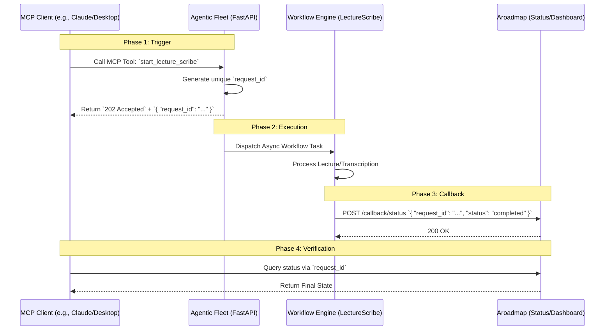

```markdown:docs/design/DESIGN-custom-1791267601657-1p4t.md
# Technical Design: Document the LectureScribe Agentic Fleet MCP round-trip

## 1. Overview & Context
- **Issue**: #custom-1791267601657-1p4t
- **Core Problem**: The LectureScribe MCP (Model Context Protocol) integration has been deployed, but there is no formal documentation outlining the end-to-end lifecycle. Operators cannot currently verify if a "docs-only" run (triggering the fleet without modifying application code) is successful because the handshake between the MCP trigger and the `aroadmap` status callback is opaque.
- **Proposed Solution**: Author a comprehensive technical guide within the `docs/` directory that maps the entire request-response-callback lifecycle. This documentation will serve as the "Source of Truth" for operators to validate the MCP integration via `request_id` tracing.

## 2. Architecture & Component Interaction



## 3. File Impact Matrix
| Action | File Path | Description |
| :--- | :--- | :--- |
| `[NEW]` | `docs/mcp/lecture-scribe-lifecycle.md` | Primary technical guide detailing the trigger, ID lifecycle, and callback mechanism. |
| `[NEW]` | `docs/mcp/troubleshooting-guide.md` | Guide for operators to trace `request_id` in logs when callbacks fail. |
| `[MODIFY]` | `docs/README.md` | Add links to the new MCP documentation section. |

## 4. Data Models & API Contracts

### MCP Trigger Request (Conceptual)
*Invoked via MCP Tool Call*
```json
{
  "tool": "start_lecture_scribe",
  "arguments": {
    "lecture_url": "https://example.com/video",
    "tenant_id": "tenant_abc_123"
  }
}
```

### MCP Trigger Response
*Immediate response to the MCP Client*
```json
{
  "request_id": "req_8823_x92j_lks",
  "status": "accepted",
  "message": "LectureScribe workflow initiated."
}
```

### Status Callback Payload
*Sent from Workflow Engine to Aroadmap*
```json
{
  "request_id": "req_8823_x92j_lks",
  "tenant_id": "tenant_abc_123",
  "status": "completed", // or "failed"
  "timestamp": "2023-10-27T10:00:00Z",
  "metadata": {
    "output_path": "s3://bucket/lecture_summary.pdf"
  }
}
```

## 5. Security, Invariants & Multi-Tenancy
- **Tenant Isolation**: The `tenant_id` must be passed through the entire lifecycle. The `request_id` is globally unique but must be scoped to the `tenant_id` in the `aroadmap` database to prevent cross-tenant status leakage.
- **Idempotency**: The `request_id` serves as the idempotency key. If the MCP client retries the trigger with the same parameters, the Fleet should recognize the existing `request_id`.
- **Defensive Safeguards**: Documentation will specify that `request_id` is the primary key for all log-aggregation queries to ensure rapid debugging.

## 6. Verification & Test Strategy
- **Documentation Review**: Ensure the sequence diagram accurately reflects the current production implementation of the `aroadmap` callback endpoint.
- **Operator Manual Test (Simulated)**:
    1. Trigger MCP tool.
    2. Capture `request_id`.
    3. Poll `aroadmap` status endpoint using `request_id`.
    4. Verify status transitions from `pending` $\rightarrow$ `processing` $\rightarrow$ `completed`.
- **Regression**: Ensure no existing documentation regarding the standard Agentic Fleet workflow is broken by the addition of the MCP-specific guides.
```