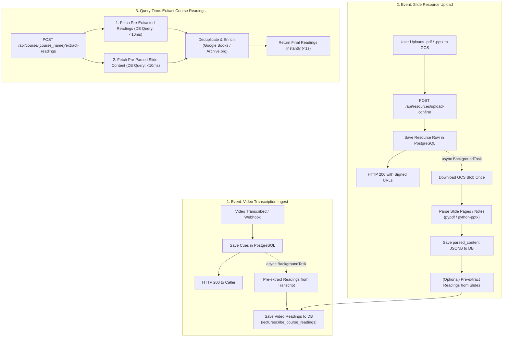

# Event-Driven Pre-Processing Architecture for Transcripts and Slides

## 1. Overview & Objective

Currently, reading extraction (`POST /api/course/{course_name}/extract-readings`) operates synchronously and on-demand:
1. It queries transcripts across all lectures in a course.
2. It downloads potentially large slide decks (`.pdf` / `.pptx`) from Google Cloud Storage on the fly.
3. It parses slides with `pypdf` / `python-pptx` within the request thread.
4. It bundles the full transcripts and slides into a large prompt and sends it to the LLM.

### Problems with the Synchronous Model
- **High Request Latency**: Downloading multiple slide decks from GCS and parsing them in real time takes 5–20+ seconds per invocation.
- **Provider Rate Limits / 413 Errors**: Bundling multiple hours of transcripts and multiple slide decks easily reaches 100k+ characters (~25k–35k tokens), exceeding on-demand per-minute token limits on fast inference providers like Groq (TPM: 8,000).
- **Redundant Compute**: The exact same lecture transcript or slide deck is downloaded and parsed repeatedly each time a user triggers extraction.

### Proposed Solution: Event-Driven Pre-Processing
Shift transcript and slide parsing from **query time** to **ingestion time**. All heavy I/O and parsing runs asynchronously via non-blocking background tasks without delaying client responses. When reading extraction is requested, results are resolved immediately or through a lightweight synthesis step.

---

## 2. Architecture Diagram



---

## 3. Component Design

### 3.1 Pipeline A: Transcript Pre-Processing (On Video Completion)

#### Trigger Points
- `POST /api/transcription/dispatch`
- `POST /api/transcription/job-status` (when status becomes `completed`)
- Initial video transcription cue loading in `backend/vimeo_client.py` or `backend/transcription_jobs.py`.

#### Execution Flow
1. Cues and lecture metadata are stored in PostgreSQL (`lecturescribe_videos`, `lecturescribe_transcript_cues`).
2. Immediate HTTP response is returned to the client/caller.
3. FastAPI `BackgroundTasks` executes `process_video_transcript_readings(video_id, course_name, cues)`:
   - Formats the single lecture's cues into a compact text block (~5k–10k tokens).
   - Prompts the LLM with the focused extraction template:
     *"Extract any textbooks, reference books, or academic readings mentioned in this single lecture."*
   - Persists any discovered items directly to `lecturescribe_course_readings`:
     ```sql
     INSERT INTO lecturescribe_course_readings 
       (course_name, title, author, reading_type, category, source_type, source_context, video_id)
     VALUES (%s, %s, %s, %s, %s, 'transcript', %s, %s)
     ON CONFLICT DO NOTHING;
     ```

#### Benefits
- Each video is analyzed individually (~1,000 cues), well within the 8k TPM limits of free/fast LLMs.
- Zero extra work required when course readings are later viewed.

---

### 3.2 Pipeline B: Slide Deck Pre-Processing (On Resource Upload)

#### Trigger Points
- `POST /api/resources/upload-confirm`

#### Execution Flow
1. Frontend finishes direct-to-GCS upload and calls `upload-confirm`.
2. Backend creates the metadata record in `lecturescribe_course_resources` and generates signed download/view URLs.
3. Immediate HTTP 200 response is sent back to the frontend so the modal completes without waiting.
4. FastAPI `BackgroundTasks` executes `process_uploaded_slide_resource(resource_id, blob_name, filename, course_name)`:
   ```python
   def process_uploaded_slide_resource(resource_id: int, blob_name: str, filename: str, course_name: str):
       # 1. Fetch blob bytes from GCS once
       slide_bytes = gcs_storage_service.get_blob_bytes(blob_name)
       if not slide_bytes:
           db_manager.update_resource_parsing_status(resource_id, status="failed", error="GCS fetch failed")
           return

       # 2. Parse per-slide text and speaker notes
       parsed_slides = parse_slide_document(slide_bytes, filename=filename)
       
       # 3. Cache parsed structure in PostgreSQL
       db_manager.save_resource_parsed_content(resource_id, parsed_slides)
       
       # 4. Pre-extract readings from slide text (if content exists)
       if parsed_slides:
           formatted_slides = format_slides_for_llm(parsed_slides, max_chars=15000)
           items = extract_readings_with_llm(course_name, transcripts_summary="", slides_text=formatted_slides)
           for item in items:
               item["source_type"] = "slide_ppt"
               item["source_context"] = f"Extracted from resource '{filename}'"
               db_manager.save_course_reading(course_name, item)
   ```

---

## 4. Database Schema Changes

### 4.1 Update `lecturescribe_course_resources`
Store pre-parsed slide content and parsing state directly on the resource record:

```sql
ALTER TABLE lecturescribe_course_resources
ADD COLUMN IF NOT EXISTS parsed_content JSONB DEFAULT '[]'::jsonb,
ADD COLUMN IF NOT EXISTS parsed_text_preview TEXT,
ADD COLUMN IF NOT EXISTS parsing_status VARCHAR(50) DEFAULT 'pending',
ADD COLUMN IF NOT EXISTS parsing_error TEXT;
```

**`parsed_content` Format:**
```json
[
  {
    "slide_number": 1,
    "title": "Course Overview & Textbooks",
    "text": "Required: Deep Learning (Goodfellow et al.)\nGrading: 40% Midterm",
    "notes": "Remind students book is available online"
  }
]
```

### 4.2 Update `lecturescribe_course_readings`
Ensure readings link back to their originating lecture video or resource when available:

```sql
ALTER TABLE lecturescribe_course_readings
ADD COLUMN IF NOT EXISTS video_id VARCHAR(100),
ADD COLUMN IF NOT EXISTS resource_id INTEGER REFERENCES lecturescribe_course_resources(id) ON DELETE SET NULL;
```

---

## 5. Course Readings Query Flow (`POST /api/course/{course_name}/extract-readings`)

With pre-processing in place, query time becomes lightweight:

```python
@app.post("/api/course/{course_name}/extract-readings")
def extract_course_readings(course_name: str, regenerate: bool = False):
    cname = db_manager.resolve_course_canonical_name(course_name)

    if not regenerate:
        # Check if course readings are already pre-extracted
        existing_readings = db_manager.get_course_readings(cname)
        if existing_readings:
            return {
                "status": "success",
                "course_name": cname,
                "readings": existing_readings,
                "count": len(existing_readings),
                "source": "precomputed_cache"
            }

    # If regenerate=True or no readings exist yet:
    # 1. Fetch pre-extracted readings from DB
    readings = db_manager.get_course_readings(cname)
    
    # 2. Fetch pre-parsed slide text (no GCS download required!)
    cached_resources = db_manager.get_course_resources_with_parsed_content(cname)
    slides_text = format_slides_from_cached_content(cached_resources)
    
    # 3. Only run LLM if there is unanalyzed content
    ...
```

---

## 6. Non-Blocking Guarantees

| Operation | User Path | Execution Mode | Latency Impact on User |
|---|---|---|---|
| **Video Transcription** | Webhook / Job Dispatch | Asynchronous | **0 ms** (Client gets instant confirmation) |
| **Video Reading Extraction** | Background Task | Background (Thread/Task Queue) | **0 ms** |
| **Slide Deck Upload** | GCS upload-confirm | Asynchronous Background Task | **0 ms** (Upload completes instantly) |
| **Slide Parsing & Storage** | Background Task | Background worker | **0 ms** |
| **User Reads Readings** | Course Readings Page | Direct Database Query | **< 500 ms** (instead of 15–30s) |

---

## 7. Additional Synergy: RAG & Instant Slide Search

Pre-parsing slides at upload time provides benefits beyond reading extraction:
1. **Searchability**: Slide text in `parsed_content` can be indexed directly into Algolia and Pinecone.
2. **In-Chat Citations**: The RAG chatbot can cite specific slide numbers and decks (e.g., *"Covered on Slide 4 of Lecture_Notes_4.1.pdf"*).
3. **Slide Previews**: The frontend can render extracted slide titles and bullet points without downloading large binary PDF/PPTX files.

