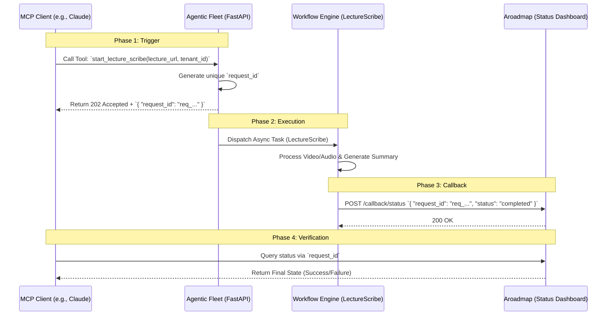

```markdown:docs/mcp/lecture-scribe-lifecycle.md
# LectureScribe MCP Lifecycle Guide

This document outlines the end-to-end lifecycle of a LectureScribe workflow triggered via the Model Context Protocol (MCP). This guide is intended for operators verifying the integration between the MCP Client, the Agentic Fleet, and the `aroadmap` dashboard.

## 1. Overview
The LectureScribe MCP integration allows an MCP-enabled client (such as Claude Desktop) to initiate complex asynchronous transcription and summarization workflows. Because these workflows are long-running, the system uses a **Request-ID-based handshake** to track progress from trigger to final callback.

## 2. Sequence Diagram



## 3. Detailed Lifecycle Phases

### Phase 1: The Trigger (MCP Tool Call)
The operator or AI agent invokes the `start_lecture_scribe` tool.
- **Input Requirements**: 
    - `lecture_url`: The source URL of the lecture.
    - `tenant_id`: The unique identifier for the organization.
- **Immediate Response**: The Fleet does **not** wait for the transcription to finish. It returns a `202 Accepted` status along with a `request_id`.

### Phase 2: Async Execution
The Agentic Fleet hands off the task to the LectureScribe Workflow Engine. The workflow handles:
1. Media downloading/streaming.
2. Speech-to-text transcription.
3. LLM-based summarization.

### Phase 3: The Status Callback
Once the workflow engine completes (or fails), it sends a webhook-style callback to the `aroadmap` service.
- **Payload**: Contains the `request_id`, `tenant_id`, and the final `status`.
- **Purpose**: This updates the database so the operator can see the result in the UI without polling the backend directly.

### Phase 4: Verification
To verify a run, the operator uses the `request_id` provided in Phase 1 to query the `aroadmap` status endpoint or dashboard.

---

## 4. API Contract Reference

### MCP Tool Response Schema
```json
{
  "request_id": "string (uuid/unique_hash)",
  "status": "accepted",
  "message": "LectureScribe workflow initiated."
}
```

### Aroadmap Callback Schema
```json
{
  "request_id": "string",
  "tenant_id": "string",
  "status": "completed | failed",
  "timestamp": "ISO-8601 string",
  "metadata": {
    "output_path": "string (optional)"
  }
}
```
```

```markdown:docs/mcp/troubleshooting-guide.md
# MCP Troubleshooting Guide

This guide provides procedures for operators to diagnose issues during the LectureScribe MCP lifecycle. The primary key for all investigations is the `request_id`.

## 1. The Golden Rule: Trace by `request_id`
If a workflow appears "stuck" or a callback is missing, **do not** search by timestamp or user. Search the centralized logging system using the specific `request_id` returned during the initial MCP trigger.

## 2. Common Failure Scenarios

### Scenario A: Trigger Successful, but no Status in Aroadmap
*   **Symptom**: MCP returns a `request_id`, but the `aroadmap` dashboard never shows the task.
*   **Likely Causes**:
    1.  **Workflow Dispatch Failure**: The Agentic Fleet failed to hand off the task to the Workflow Engine.
    2.  **Network Partition**: The Workflow Engine completed the task but could not reach the `aroadmap` callback endpoint.
*   **Investigation Steps**:
    1.  Search logs for `request_id` in the **Agentic Fleet** service to confirm task dispatch.
    2.  Search logs for `request_id` in the **Workflow Engine** to see if the task was picked up.
    3.  Check `aroadmap` ingress logs for incoming POST requests to `/callback/status`.

### Scenario B: Workflow Status is "Failed"
*   **Symptom**: The task appears in `aroadmap` but is marked as `failed`.
*   **Likely Causes**:
    1.  **Media Access Error**: The `lecture_url` is private, behind a login, or the video is unavailable.
    2.  **Transcription Timeout**: The audio file was too long or the speech-to-text service timed out.
    3.  **LLM Error**: The summarization step failed due to context window limits or API errors.
*   **Investigation Steps**:
    1.  Retrieve the `request_id`.
    2.  Filter logs in the **Workflow Engine** for that `request_id`.
    3.  Look for `ERROR` level logs immediately preceding the `status: failed` callback.

### Scenario C: Tenant ID Mismatch
*   **Symptom**: The callback is sent, but `aroadmap` does not update the user's view.
*   **Likely Causes**:
    1.  The `tenant_id` passed in the MCP trigger does not match the `tenant_id` associated with the `request_id` in the `aroadmap` database.
*   **Investigation Steps**:
    1.  Verify the `tenant_id` in the initial MCP tool call arguments.
    2.  Verify the `tenant_id` in the callback payload.

## 3. Log Search Patterns

| Target | Search Query Pattern |
| :--- | :--- |
| **Initial Trigger** | `grep "request_id: <ID>" backend/logs/fleet.log` |
| **Workflow Progress** | `grep "request_id: <ID>" workflow/logs/engine.log` |
| **Callback Arrival** | `grep "request_id: <ID>" aroadmap/logs/api.log` |

## 4. Verification Checklist for "Docs-Only" Runs
When performing a test run to verify the MCP connection:
1. [ ] Capture `request_id` from the MCP Client response.
2. [ ] Confirm `request_id` appears in Agentic Fleet logs (Dispatch phase).
3. [ ] Confirm `request_id` appears in Workflow Engine logs (Execution phase).
4. [ ] Confirm `request_id` appears in Aroadmap logs (Callback phase).
5. [ ] Verify final status in the Aroadmap UI matches the expected outcome.
```

```markdown:docs/README.md
# LectureScribe Documentation

Welcome to the official documentation for the LectureScribe Agentic Fleet.

## 📖 Contents

- [Architecture Decision Records (ADRs)](docs/adr/)
- [System Overview](docs/overview.md)
- [MCP Integration Guide](docs/mcp/)
    - [Lifecycle Guide](docs/mcp/lecture-scribe-lifecycle.md): How the MCP trigger and callback loop works.
    - [Troubleshooting Guide](docs/mcp/troubleshooting-guide.md): How to trace `request_id` and debug failures.

## 🚀 Quick Start

... (existing content) ...
```